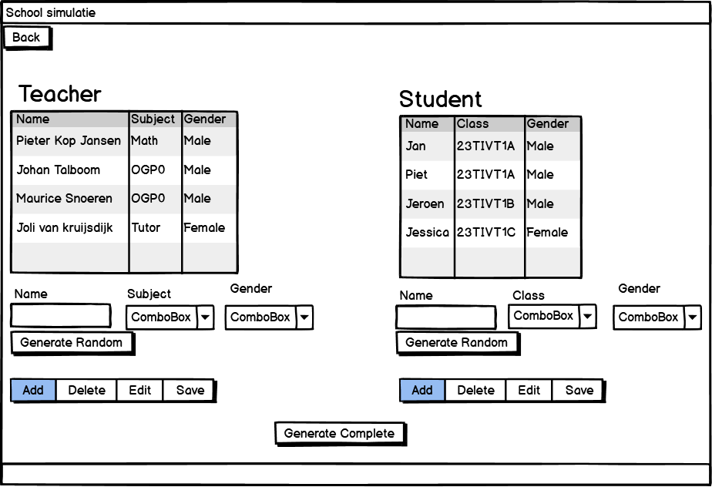
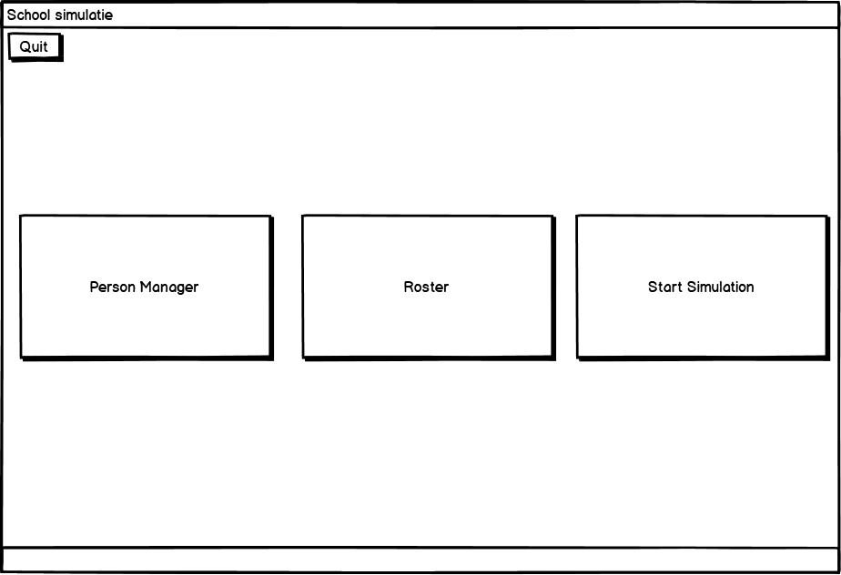

# Week 2

In week 2 heb ik voornamelijk gewerkt aan de GUI. Deze heb ik gemaakt in SceneBuilder, een tool waarin je efficiënt FXML-code kan generen, omdat het mij handig leek en ik er meer van wilde weten. De GUI die ik gecreëerd heb is nog niet werkend en is gebaseerd op de schetsen die we als groep eerder gemaakt hebben. Deze windows worden verder niet ingeladen in de code.

**Van schets:**

**Naar:**

 

