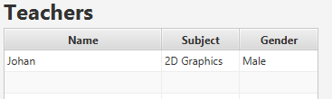

# Week 3

Ik ben verder gegaan met de GUI. Ik heb een vergadering  geïnitieerd, geleid en vragen aan de groep gesteld. Daarnaast voorgesteld om alles zo ver te mergen, de Development branche aan te maken in de git (zodat de master alleen stabiele versies krijgt) en om in nieuwe branches te werken in plaants van branch 'Bartinos' of 'Frank'. Daarna bezig geweest met applicatie waarmee ik nu verder mee kan i.v.m. de antwoorden op de vragen.

- **Gaan we tabs, view venster gebruiken of laten we het zo?**

_Tabs, het is dan een stuk meer overzichtelijker, simpeler en netter._

- **Hoe worden groepen aangemaakt in de GUI? Zit daar een maximum aan? Een minimum?**

_Groepen worden voorgeprogrammeerd._

- **Zijn de vakken vast voor geprogrameerd. Zo ja, welke vakken zijn er?**

_Ja, welke wordt nog gediscusseerd._

- **Kunnen legen groepen les krijgen?**

_Groepen die les krijgen zijn niet leeg_

- **Wat gebeurt er als alle groepen vol zijn en 'Generate Random' wordt gedrukt?**

_Dan wordt er een fout melding gegeven._

- **Hoeveel genders zijn er?**

_2 om het simpel te houden_

De gui heb ik dus 'omgebouwd' naar een tabPane. Daarnaast heb ik ook de tab voor de lessen gemaakt en deze hierin geimplementeerd. Ik heb het originele start scherm verwijderd en heb alle controllers in de nieuwe tabs een ID gegeven, zodat ze bereikbaar zijn in de code.

Daarnaast heb ik nog code geoptimaliseerd, zoals naamgeving veranderd en code aangepast naar onze codingStyle.
Nadat er code toegevoegd is voor de PersonManager tab, heb ik ervoor gezorgd dat de edit functie het werkelijk ook werkt.

        teacherNameColumn.setOnEditCommit(event ->
                teachersTable.getItems().get(event.getTablePosition().getRow()).setLastName(event.getNewValue()));
        teacherSubjectColumn.setOnEditCommit(event ->
                teachersTable.getItems().get(event.getTablePosition().getRow()).setSubject(event.getNewValue()));
        teacherGenderColumn.setOnEditCommit(event ->
                teachersTable.getItems().get(event.getTablePosition().getRow()).setGender(event.getNewValue()));

Daarnaast heb ik ervoor gezorgd dat de combobox in Roster de beschikbare teachers toont. Hierdoor is het makkelijk om een teacher te kiezen in Roster, waardoor je ook geen fouten kan maken.

        teachersTable.getItems().addListener(new ListChangeListener<Teacher>() {
            @Override
            public void onChanged(Change<? extends Teacher> c) {
                comboTeacherNameList = teachersTable.getItems();
                System.out.println("Teacher added to combobox");
                teacherAllNameBox.setItems(comboTeacherNameList);
            }
        });
        

